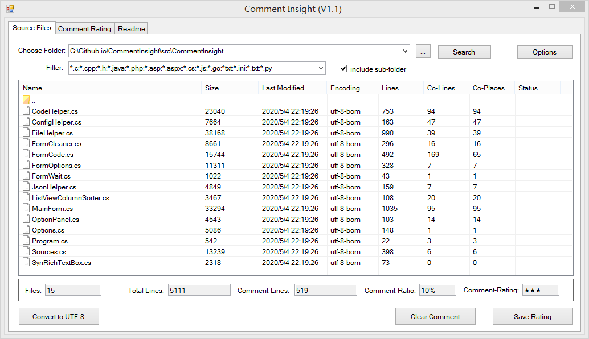
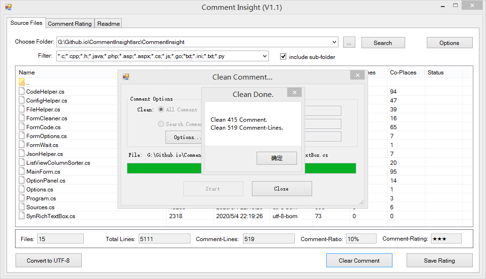

# Comment Insight
Sourcecode comments statistics clean tool, support language: C,CPP,C#,Python,Php,Java,Go.

源代码注释统计&清理工具，支持编程语言C,CPP,C#,Python,Php,Java,Go

## Feature 功能
- Count comment lines in source files 分析&统计源代码中的注释
- Clean comments 清除注释
- Convert Source files encoding to UTF-8 转换源代码的文件编码

## Download 下载
- Support Windows 7,8,10+, .Net Freamwork 4.5.2
- Download prebuild version: https://github.com/CommentInsight/CommentInsight/releases
- GithubPages: https://CommentInsight.github.io 
- Website: http://www.commentinsight.com

## Develop
- Getting source code from git repository:
~~~
git clone https://github.com/CommentInsight/CommentInsight.git
~~~

- Build the project by Visual Studio 2019

## screenshot 截图

	
	
	
	
	

## Copyright
### This is free software, and you are welcome to redistribute it under certain conditions
- ALL credit goes to **Comment Insight User Group** and **Comment Insight Development Group**


## Licences

Comment Insight is licenced under [](https://www.gnu.org/licenses/gpl-3.0) 

```
    Comment Insight, A Sourcecode's comments statistics clean tool. 

    This program is free software: you can redistribute it and/or modify
    it under the terms of the GNU General Public License as published by
    the Free Software Foundation, either version 3 of the License, or
    (at your option) any later version.

    This program is distributed in the hope that it will be useful,
    but WITHOUT ANY WARRANTY; without even the implied warranty of
    MERCHANTABILITY or FITNESS FOR A PARTICULAR PURPOSE.  See the
    GNU General Public License for more details.

    You should have received a copy of the GNU General Public License
    along with this program.  If not, see <https://www.gnu.org/licenses/>.
```
