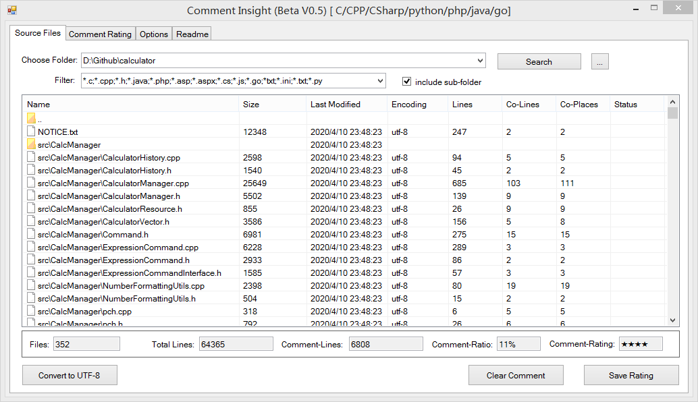
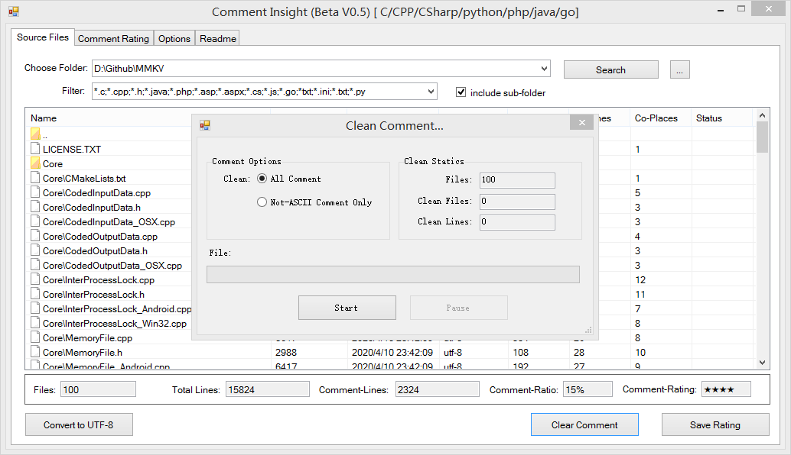
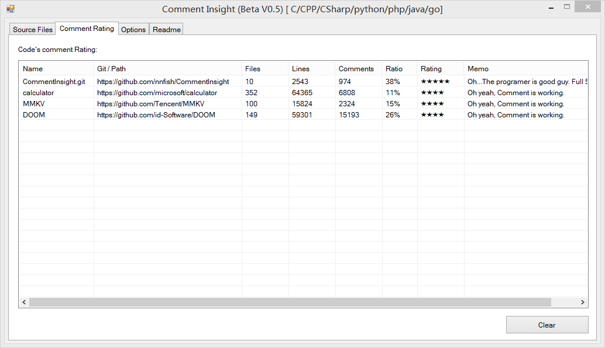
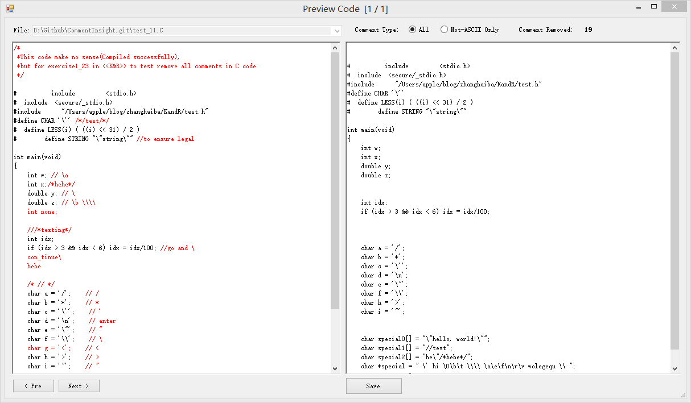
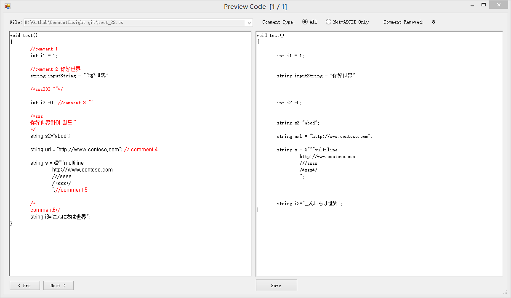

# Comment Insight
Sourcecode comments statistics clean tool, support language: C,CPP,C#,Python,Php,Java,Go

源代码注释统计&清理工具，支持编程语言C,CPP,C#,Python,Php,Java,Go

## Feature 功能
- Count comment lines in source files 分析&统计源代码中的注释
- Clean comments 清除注释
- Convert Source files encoding to UTF-8 转换源代码的文件编码

## Download 下载
- Support Windows 7,8,10+, .Net Freamwork 4.5.2
- Download prebuild version: https://github.com/nnfish/CommentInsight/releases
- GithubPages: www.commentinsight.com

## Todo-List
- MacOSX Version

## screenshot 截图

	
	
	
	
	

