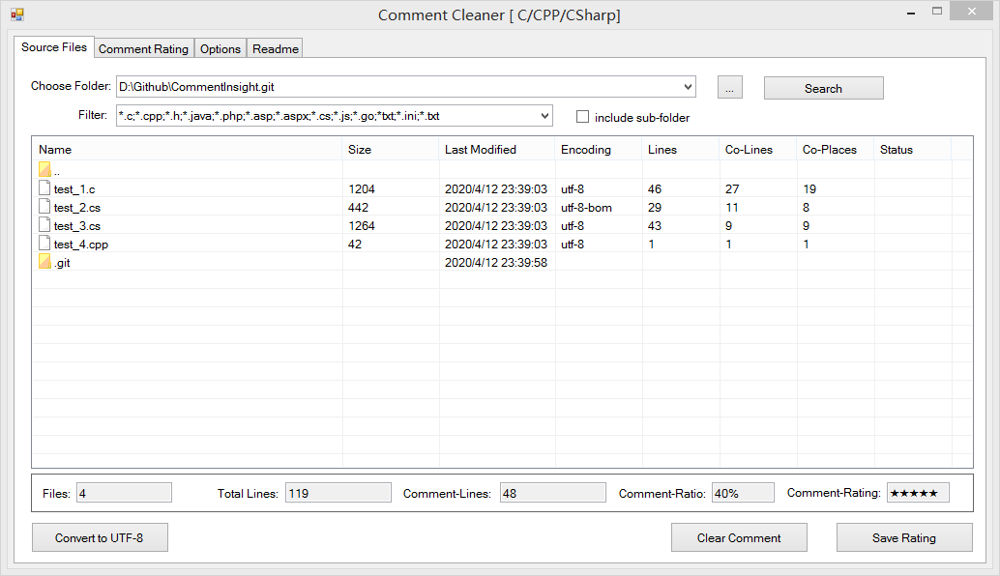
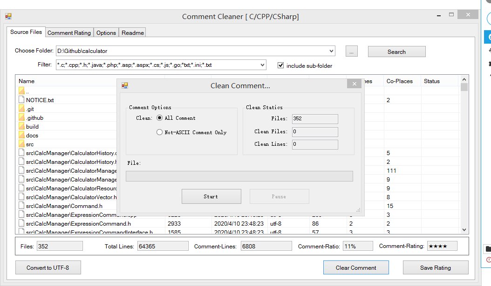
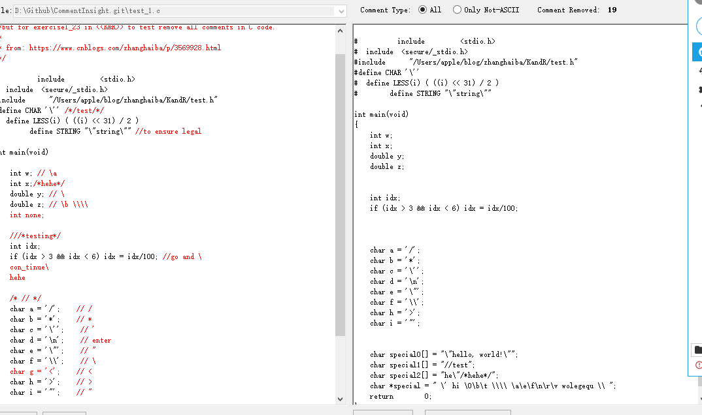
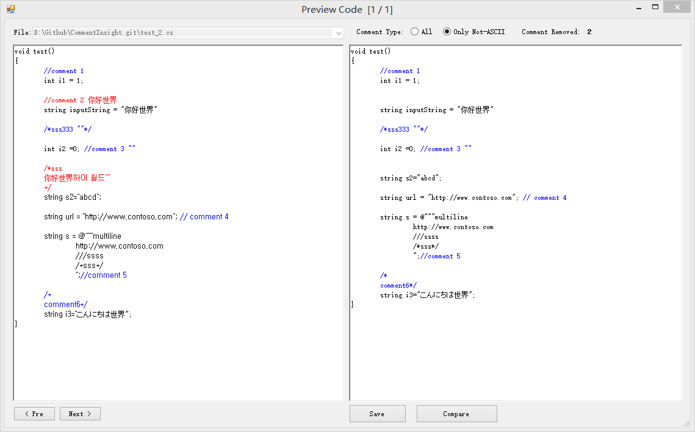
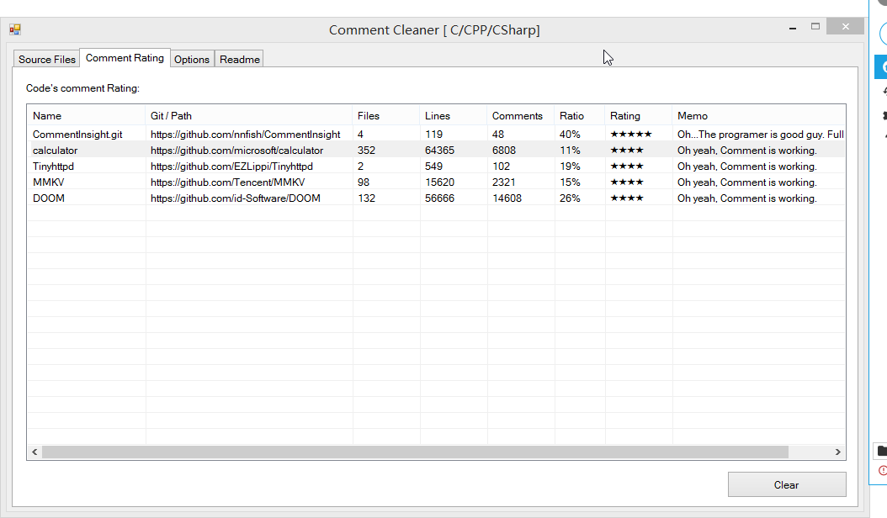

# CommentInsight
Easy to Search&amp;Count&amp;Clean the comments in your SourceCode.  源代码注释统计&amp;清理工具

## Feature 功能
- Convert Source files encoding to UTF-8;
- Count comment lines in source files;
- Clean comments;

## screenshot 截图

	
	
	
	
	

